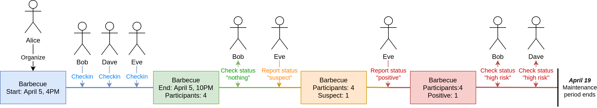

# Corona Network Events

Events in the Corona Network represent real world meetups: house party, office meeting, girls night out, etc. Their purpose is to anonymously link multiple people together, so that they may notify each other about potential infection risks.

Practical details:

- An event is always organized by a single person, who will act as the relay between the participants. This ensures that individual participants don't have to know or trust each other, but can still send and receive alerts.
- An event starts when the organizer creates it and terminates when the organizer closes it. After closure, the organizer of the event will keep maintaining it for `14 days` to allow participants to report infections.
- Although an event can run arbitrarily long, it is recommended to create separate events if something lasts for multiple days, since there's a high probability that the participants are disjoint.
- After the maintenance period expires, the event is frozen and cannot be updated any more. It remains read only for `1 month` to act as a journal, after which all associated information is permanently deleted. There is no way to back it up.
- While the event is running, the organizer can display a QR code, which participant scan to check-in to the event. Checking in requires an active internet connection as the authentication codes are rotated live. This guarantees proof-of-presence.
- Checking in shares absolutely no information with the event organizer, only pings it to bump the attendee count. Information will only ever be sent to the event in case of suspected or positive infection.
- Authorized (checked in) participants can for the duration of the event (+ the `14 day` maintenance period) request infection updates (suspect or confirmed cases at the event) and push their own status too.
- If a participant updates their infection status to confirmed positive, confirmed negative or suspect, that is sent to the event organizer along with their profile infos to permit sanity checking suspicious reports.
- The organizer may manually (e.g. phone call) confirm whether a status update is legitimate. The report and optional checkup will be merged into the event's statistics, but details will not be made available to participants.



## Technical details

To create an event, an organizer generates a new random cryptographic identity and address, which together will form a `tornet` server. The organizer will run this server for `14 days` after the event ends.

When the organizer wishes to check a participant in, they generate a QR code consisting of the event's public key, event's public address and a single-use auth token. A participant in will use these credentials for initial contact, through which it negotiates a long-term auth token.

Participants will periodically `3-6 hours` connect to the `tornet` server and retrieve any updated statistics, recalculating their own probability of being infected.

If on the other hand a participant is deemed infected (or suspect) based on participation in other events; or based of self reported test results / symptoms, they will actively attempt to push their status update to the event every `30 minutes`, until they are successful.

### Technical caveats

**Why use a new identity/address for the event and not the organizer's?**

Events are ephemeral. They last a few weeks, after which they are permanently deleted. By using ephemeral identities, it becomes impossible to track organizers across events.

**Why check in with a random identity instead of your own?**

Most participants will not send infection updates to events, rather will only gather statistics about their own past presences. By keeping the identity of participants secret, organizers will not be able to track participants across events.

## Event protocol v1 (draft)

The purpose of the `event` protocol is to act as the communication ruleset between an event organizer and the event's participants. The wire protocol follows the general mechanisms outlined in [wire.md](./wire.md).

The envelope is:

```go
// EventsMessage contains all possible messages sent and received.
type EventsMessage struct {
	Handshake  *system.Handshake
	Disconnect *system.Disconnect
	Checkin    *events.Checkin
	CheckinAck *events.CheckinAck
	GetStatus  *events.GetStatus
	Status     *events.Status
	Report     *events.Report
	ReportAck  *events.ReportAck
}
```

Whenever a connection is made to an event's `tornet` server, the authentication credentials (verified and enforced by `tornet`) defines what phase the connection will be in:

- If the credential is the current ephemeral check-in secret, the remote peer is expected to run a checkin round.
- If the credential is a long-term participant identity from a previous check-in round, the remote peer is expected to exchange data.

### Check-in messages

The checkin process is a fairly straightforward request/reply exchange. The client wishing to check in needs to create its own temporary identity for the event and send it over to the organizer. In addition, the message also needs to contain a digital signature over the original authentication credentials to prove that the client owns the identity.

```go
// Checkin represents a request to attend an event.
type Checkin struct {
	Identity  []byte // Ephemeral tornet identity to check in with
	Signature []byte // Digital signature over the auth credentials 
}
```

Upon receiving a checkin request, the event will verify the signature, and if it checks out will reply with a confirmation. If an error occurs, the confirmation will contain a short reason (mostly developer aid).

```go
// CheckinAck represents the organizer's response to a checkin request.
type CheckinAck struct {
	Failure error // Failure reason if the checkin was denied
}
```

Independent whether a checkin is successful or not, the authentication credentials is burned and cannot be reused a second time.

### Data exchange messages

The basic data exchange that participants and the organizer will do is request and return event statistics. The role of these are to warn participants of potential infection risks from the event.

```go
// GetStatus requests the public statistics and infos of an event.
type GetStatus struct {}

// Status contains all the information that's available of the event.
type Status struct {
	Start time.Time // Timestamp when the event started
	End   time.Time // Timestamp when the event ended (0 if not ended)

	Attended  uint // Number of participants in the event
	Negatives uint // Participants who reported negative test results
	Suspects  uint // Participants who might have been infected
	Positives uint // Participants who reported positive infection 
}
```

*Participants should check for updates every now and again, but they should not expect real time warnings. A potentially good polling time could be `3-6 hours`.*

If a participant has an infection status update that's relevant for the event's timeline, they can send an update report to the organizer. Beside the new infection status and an optional note, the report also sends over the participant's permanent identity and name to allow out-of-protocol verification of reports.

The signature is over the event identity and the report fields (name, status, message). These are used to prevent duplicating reports across events.

```go
// Report is an infection status update from a participant.
type Report struct {
	Identity []byte // Permanent tornet identity to report with
	Name     string // Free form name the user is advertising (might be fake)

	Status    string // Infection status (negative, suspect, positive)
	Message   string // Any personal message for the status update
	Signature []byte // Signature over the event identity and above fields
}

// ReportAck is a receipt confirmation from the organizer.
type ReportAck struct {
	Failure error // Failure reason if the report was denied
}
```

*If a participant's infection status changes, they should attempt to have it pushed through to all relevant events fast. A potentially good retry time could be `30 minutes`.*
