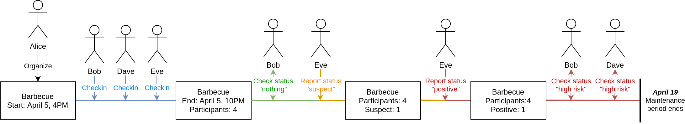
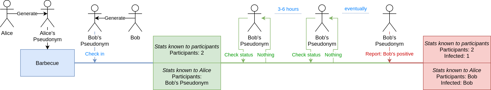

*Abstract: The **Corona Network** is a decentralized system to aid in social distancing during the Coronavirus pandemic. It helps keeping an account of physical contacts and tracking suspected and confirmed infections across your friend circle. The goal is to act as an early warning system to self-isolate and to omit meeting potential carriers.*

*The Corona Network was designed from the ground up for **anonymity and privacy**. Data is stored exclusively on your mobile device and shared directly, end-to-end encrypted, with your approved contacts and events. Network connectivity is tumbled across the globe, anonymizing even your metadata. There is **no cloud, no server, no tracking!** Neither the authors, nor any other party can derive any data about you.*

*Source code is available for public scrutiny at https://github.com/coronanet/go-coronanet. Note, the code is made available for **verification**. You are **not** granted a license to reuse it!*

# Introduction

This paper presents a novel decentralized and anonymized social network, the *Corona Network*, designed for Coronavirus contact tracing and infection inference; without a central operator and without the possibility of user tracking or data mining.

The *Corona Network* is similar in purpose to Singapore's TraceTogether[^1] app, Israel's HaMagen[^2] app, or Google and Apple's contact tracing system[^3], namely to allow users to detect if they might have come into contact with an infected person. Opposed to these, the *Corona Network* does not have a central operator and does not permit user tracking.

[^1]: https://www.tracetogether.gov.sg/
[^2]: https://play.google.com/store/apps/details?id=com.hamagen&hl=en
[^3]: https://blog.google/inside-google/company-announcements/apple-and-google-partner-covid-19-contact-tracing-technology

All alternative systems mentioned above employ Bluetooth beacons, through which mobile devices advertise their presence to one another. These announcements are tiny encrypted identities that devices collect throughout the day and share with authorities when someone tests positive. The only way for the central operator to notify potential contacts, is for every user of the system to constantly *phone home* to a centrally operated server, which raises privacy concerns.

Even more serious issues arise with designs around Bluetooth, because the cryptographic announcements are only rotated every so often, but they can be received from quite a significant distance. By scattering bluetooth listeners across a wide area (block, city, state), it becomes possible for ***anyone to track the movement*** of users broadcasting these beacons. With a bit of statistical analysis, a determined attacker should be able to match a newly appeared beacon to ones that disappeared around the same place/time.

A last serious design flaw with Bluetooth technologies that favor Google heavily, is that Bluetooth beacons require *Location Services* to be enabled on Android devices. By enabling it however, Google services running on the mobile devices have access to full GPS coordinates, which Android collects and shares with Google by default. ***The only way to allow any app on the device to listen for Bluetooth announcements, is to also grant Google services GPS access.*** As such, any solution using Bluetooth scans is trackable by Google.

Opposed to all the above systems, the *Corona Network* does not rely on Bluetooth technologies, specifically due to their weak privacy guarantees. This does mean, that the work presented in this paper cannot automatically link people together, but this in our opinion is a feature, not a bug in the grand scheme of things. By sacrificing automatic contact detection in favor of a user-initiated check-in mechanism, we created a system that does not rely on any notion of location whatsoever, making it impossible for third parties to track the users' whereabouts.

In the first half of this paper we will present the general construction of the social network, and we will explain its high level operation and how it achieves its promised privacy features. The second half of the paper dives a bit deeper into the cryptography and networking mechanisms that underpins the system.

This paper does not attempt to present protocol specifications and explain implementation details, but the reader is welcome to check the technical specs and source code at https://github.com/coronanet/go-coronanet. Please note however:

- The system is a work in progress, specs may be lacking, features missing.
- The source code is available for verification, but is not licensed for reuse.

# Social network

At its very core, the *Corona Network* is a decentralized social network. Opposed to the common interpretation however, our system does not revolve around content creation or real time user interaction. The single purpose is to build an ***anonymous and private*** contact network, with just enough metadata to allow Coronavirus infection statuses to propagate between people who mutually trust each other.

There are ***no servers*** and ***no registered users*** in the *Corona Network*. Every participant's mobile device holds their own, randomly generated secret identity (a cryptographic key). Users may associate an arbitrary name and a profile picture with their identities to keep their experience friendly, but these are mostly niceties. The secret identities are completely independent of any external services. The only way to establish contact with someone else is to exchange contact details ***in person***. This ensures that it is impossible to track who uses the *Corona Network*, and thus avoids granting anyone the possibility of data mining your private information.

All communication in the *Corona Network* is ***end-to-end encrypted*** between two secret identities, which is guaranteed to be untappable. Communication between users does not go through a central operator, rather mobile devices talk ***directly to one another***, making it impossible for outsiders to track that communication even took place. Furthermore, communication channels between devices are ***tumbled across the globe*** (through Tor), ensuring that not even IP address metadata can be data mined.

The *Corona Network* is borderline paranoid on security, privacy and anonymity, but we firmly believe that that is the single acceptable approach of handling personal data. ***Anyone saying you need to a central operator is consciously lying to you!***

## Infection status updates

By allowing everyone to generate their own identities and exchange it with the people they trust, we've managed to form a decentralized social graph that can actually communicate across the globe. Before diving into details however, we need to define what to communicate about.

The purpose of the *Corona Network* is to let users self-report suspected or confirmed Coronavirus infections, allowing the system to automatically infer high risk individuals; and ***warn them anonymously***. To do this, every user of the system is (self-)assigned an infection status out of a set of five:

- `Unknown`: No meaningful information can be said. A user lands in this status if they have not self-reported anything; they have not participated in activities that would permit the system to infer their risk; or too much time passed for the last data point to be relevant.
- `High Risk`: Automatic status inferred by the network, where the user has not self-reported anything recently, but their activities lend to the belief that they face an elevated risk of being infected. Note, this is inferred ***by their own device***, not externally!
- `Suspected`: User self-reported potential Coronavirus symptoms. This does not yet mean a positive infection, only a high probability of it. Whenever a user elects to share this, it will result in a cascade of notifications throughout the network.
- `Positive`: User self-reported a medical Coronavirus test resulting positive. This is the highest possible confirmation for an infection and is a serious status update. A user is only allowed to exit this status with a `negative` test.
- `Negative`: User self-reported a medical Coronavirus test resulting negative. Similar to `positive`, this status update is a significant confirmation for non-infection.

Everyone using the *Corona Network* starts out in the `unknown` status and transitions across these 5 states based on the rules in the diagram below (the `high risk` case is an automatic inference that we'll explain in a bit; the others should be self explanatory):

{ width=350px }

Essentially, respecting the transition rules above, users can change their own infection statuses on their mobile devices. If we plug these updates into the social graph, we can form a notification network where users get informed when their contacts post elevated infection risks; permitting others to evaluate the dangers involved in a physical meetup.

Whilst this in itself could be useful, it relies too heavily on users being responsible and pedantic enough to self-report risks. Manual status updates are good as triggers, but we need automatic inference to make the network really useful. That's a problem...

## Spatial and temporal links

The Coronavirus spreads via physical contact, thus the only way to meaningfully infer infection, is to track potential physical contact between users. This poses an enormous privacy risk, especially coupled with health data and a central operator.

To retain the network's cornerstone of anonymity, we need to make an essential observation. The only piece of data an inference algorithm needs, is an abstract link, that a set of people were at the same place at the same time. It is however totally irrelevant where that place was spatially, or when that time was temporally. Thus we introduce the notion of a ***cryptographic event***.

Events in the *Corona Network* represent real world meetups: dance festival, office meeting, girls' night out, etc. Their purpose is to link multiple people together, so that they may notify each other about potential infection risks. Opposed to a usual programmer approach, events in the *Corona Network* are not secondary data structures, rather are fully fledged cryptographic identities that communicate.

An event is organized by a single person, whose mobile device hosts the event identity. The same way that users exchange contact details to communicate through the *Corona Network* with each other, they can exchange event details to communicate with the event itself. The event will thus act as the relay between the participants, enabling users who otherwise don't know or trust each other to indirectly communicate.

Communication with an event is deliberately simple. Participants can retrieve anonymous infection statistics (number of participants, ratio deemed high risk, number reporting positive infection, etc); and they can notify the event of their own status changes (e.g. a participant develops symptoms). The event acts as an ***anonymizer between participants***, relaying statstics, but filtering personal data.

This event model closely follows real world trust relationships: participants generally know and trust the organizer, but they may not know or trust each other. Information they share is sensitive, but only the organizer can link it to them, whereas for everyone else it becomes an anonymous data point.

## Infection status cascade

The purpose of an event is to link multiple people together ***at a given point in time*** (e.g. Alice and Bob at the same barbecue). Participants themselves, however, link multiple events together ***across time*** (e.g. Alice went to both a barbecue and a movie). This results in events and users in the system forming a unified communication graph.

This is an immensely powerful construct, as every time a person posts an infection status update, a risk notification propagates to other people through shared events, but also propagates to other events through shared people. Essentially, a single self-reported infection results in a cascade reverberating across the entire global network, notifying gradually more and more people that might have been in indirect contact with the origin.

By automatically propagating these status updates and infection risks through the social and event network, everyone's own mobile device can in real time detect if they came in contact with people who pose heightened risks, without actually gaining any information about those people whatsoever. At that point it's up to the individual user to do whatever is appropriate for mitigating the risk.

And... that's it. With two communication constructs (user-to-user and user-to-event), we've been able to assemble a purpose built social network that can infer infection risks, while maintaining anonymity and privacy for its users.

# Cryptography and networking

In the previous section we've described that identities in the *Corona Network* are random cryptographic keys stored on users' mobile devices, which can communicate with other identities. This is a bit hand wavy, so lets expand on it first.

A *Corona Network* user identity is a dual `ed25519` private key:

- A ***permanent*** `ed25519` key acts as the identification of the user, which is used for end-to-end encryption and digital signatures. This key is what users identify each other through, it is generated once and can never change.
- A ***rotating*** `ed25519` key acts as the discovery address and rendezvous point for the user within the Tor network. Access to the public portion of this key enables opening a communication channel to the user.

When users wish to establish contact with someone they trust, they exchange their public keys between each other (via a QR code scan) and authorize the other side. But how does knowledge about the other's identity help actually establish a communication channel?

Every user of the *Corona Network* is running a ***Tor onion service[^4]*** on their mobile device, which is exposed at the discovery address represented by the second key in their identity. Anyone with whom a user shared their credentials with can look up the onion service via the public key of the discovery address and establish a network connection.

Inbound connections are however not blindly trusted, rather the entire stream is wrapped in an additional TLS layer, which uses both server and client side authentication (via the permanent keys of the identities). This ensures that communication between two users can only take place if the mutually authorized each other.

This network routing construction means that any two users that exchange `64 bytes` of secret data with each other can communicate directly, securely and anonymously. Essentially, we've just created a ***peer-to-peer social graph***, where everyone only talks to people they personally trust.

[^4]: If the reader is unfamiliar with Tor, it is a global communication network whose purpose is to tumble a data stream across multiple random computers in the world, hiding the origin and destination from prying eyes. In our use case, the Tor network also acts as the rendezvous point for mobile devices so they don't have to worry about NAT traversal.

The social graph constructed via the user identities follows the exact same trust relationships as those users have with one another, so infection status updates can stream freely between them. To automatically infer things, we need to bring *events* into the picture.

## Event pseudonymity

Opposed to users trusting one another, events are a bit less trustworthy. Generally people will be fine telling their friends about their infection statuses, but they will definitely not want to share it with a random person who just happened to attend the same event. As such, events are wrapped in an additional layer of pseudonymity.

The organizer of an event will not use their own identity to host the event, rather will generate a fresh identity just for the event. This allows participants to check into events without needing to exchange trust with the organizer. It also prevents participants from tracking the organizer across events. Similarly, participants do not check into events with their real identities, rather they also generate a fresh private key to act as a pseudonym. This prevents event organizers from tracking the participants across events.

Network communication itself follows the same principles as between users:

- The event discovery address defines the Tor onion service rendezvous point
- The event checkin is the secret exchange for swapping pseudonym public keys
- The exchanged pseudonyms defines the TLS authentication and encryption

Since most events will never receive an infection update, there is absolutely no reason for users to reveal their real world identities. After the event is over and the grace period ends, everyone throws away their pseudonyms and it's as if it never even happened.

If a participant wishes to propagate an infection status to the event however, they will need to reveal their real identity to the organizer. This is required to allow fact checking reports and avoid abuse by malicious reports.

# Epilogue

This whitepaper presented a decentralized social network that can help infer Coronavirus infection risks, whilst maintaining full user anonymity and privacy; and also preventing (by construction) any form of tracking and data mining. The goal of this work is to demonstrate that it is possible, feasible and practical to aid people in social distancing and contact tracing without the need of a central operator.

Furthermore, the *Corona Network* should be able to actually ***outperform at inference capacity*** the alternative proposals based on Bluetooth beacons. As the Bluetooth approach relies on a central operator to distribute notifications, they are a bottleneck for information propagation; and as they rely on manual testing, they make automatic inference impossible. Opposed to Bluetooth designs, the *Corona Network* forms a single communication network out of all users and events, permitting infection risks to automatically cascade across multiple links, notifying not only if a contact got infected, but if there was a 2-3 hop to such a person too.

There is an important limitation to keep in mind. Being driven by self-reported symptoms and test results, the *Corona Network* can ***never infer that someone is not infected*** (that is why the default status is `unknown`). The system an, at best, signal elevated risks for some of its users. It is up to each and every user to meaningfully interpret their situation and take the necessary precautions.
